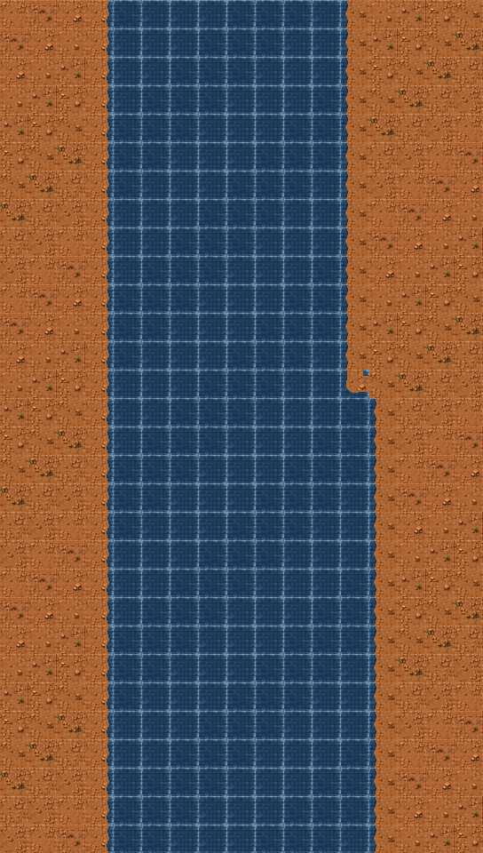

# Epoch 17.7 — Connected Canyon and Visual-Only Terrain

## Release identity

- **Application version:** 0.9.0
- **Release:** SkyForge Epoch 17.7
- **Primary objective:** remove terrain collision from active gameplay and rebuild Level 01 with deterministic adjacency-aware canyon rendering.

## Why the previous level failed visually

The screenshot supplied during review exposed two independent implementation defects:

1. The river backdrop used a lower scroll ratio than the cliff layers. The layers therefore separated during play and exposed black seams.
2. The frames reserved as “Cardinal-16” cliff variants were unrelated cave and terrain stamps rather than connected edge silhouettes. Assigning them by adjacency mask produced apparently random brown fragments in the river.

The river animation also included frames that contained rock/stamp artwork, which introduced additional floating fragments.

## Runtime terrain policy

`TerrainRuntime` is now a presentation-only chunk renderer.

Removed from active runtime behavior:

- player clamping or separation from canyon walls;
- contact damage and lethal terrain contact;
- player-projectile and enemy-projectile blocking;
- destructible terrain collision;
- default gates and barriers;
- terrain-object destruction events in `GameScene`;
- collision arguments from normal and Studio-simulation terrain updates.

The generic terrain package schemas and a non-blocking corridor guide remain in the project so the mechanic can be reconsidered without a package-format migration. They have no blocking or damage effect in the default game.

## Rebuilt Canyon Passage

Level 01 is generated deterministically by `scripts/build-canyon-level.py` from authored control points.

### Map structure

| Layer | Purpose | Cells | Scroll ratio |
| --- | --- | ---: | ---: |
| `river_base` | continuous aligned river beneath the complete map | 13,600 | 1.0 |
| `cliff_surface` | connected sandstone occupancy | 6,102 | 1.0 |
| `cliff_rim` | exposed shoreline generated from the same masks | 1,600 | 1.0 |

The map contains 800 rows at 32 pixels per row. Its final authored world position is 24,608 pixels, covering the Level 01 scroll profile of 24,150 pixels.

### Adjacency-aware tiles

Each cliff cell receives a four-bit N/E/S/W occupancy mask:

- North = 1
- East = 2
- South = 4
- West = 8

Masks 0–15 select frames 32–47. The matching shoreline overlay uses frames 48–63 with the same mask. Terrain at the outer map boundary connects to the exterior rather than being cut away, preventing blue holes at the screen edges.

Interior mask 15 uses stable canyon-surface variation, while exposed cells use transparent connected silhouettes. The editor’s autotile command now recomputes variants with explicit map bounds and regenerates the rim layer from the same source cells.

### Water correction

The river is a full-width base at scroll ratio 1. It no longer relies on a differently scrolling corridor backdrop. Runtime animation is restricted to clean frames 11 and 12 at 2 FPS; former rock/stamp frames are not part of the river animation.

## Level and Studio cleanup

- The default terrain object set is empty.
- Level 01 contains no `terrainState` events.
- The Collision tool is removed from the active Level Studio toolbar.
- New projects prefer the `terrainSurface` layer for editing instead of a collision-aligned layer.
- The checked-in level pack, asset pack, Git-folder examples, lockfile and compiled release were regenerated.

## Compatibility

Older Level Packs still parse through the existing schema. Imported gates and barriers can still be drawn as presentation objects, but they do not block or damage gameplay. Collision definitions remain loadable as dormant analysis data.

## Visual reference

The following image is rendered directly from the final map JSON and final atlas, not from a concept mock-up:

